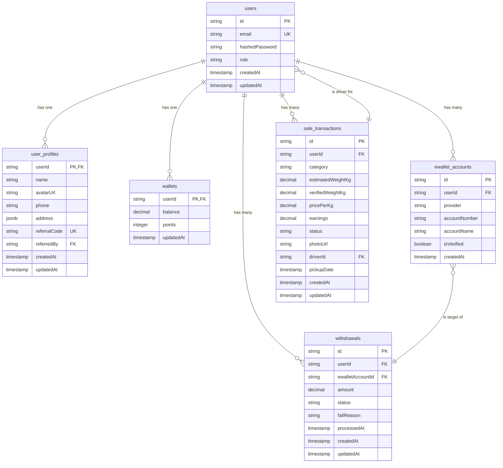

# GreenEarth: Database Architecture & Design

This document outlines the database architecture for the GreenEarth application, providing parallel designs for a NoSQL (Firestore) and a Relational (PostgreSQL) implementation. It serves as the definitive schema contract for backend development, ensuring full alignment with the API and frontend requirements.

## 1. Overview

The GreenEarth system is a mobile-first platform designed to encourage and manage recycling activities. It involves user management, financial transactions (wallet), activity tracking (pickups), and community engagement. The database must support these features reliably and scale efficiently.

### 1.1. Major Entities
- User & Profile
- Wallet & Points
- Withdrawals & E-Wallet Accounts
- Sales Transactions & Pickups
- Leaderboard
- Notifications
- Articles & Community Content
- Auditing & System Data

### 1.2. Global Conventions
- **ID Generation**: All primary keys (`id`) will use **CUID2** for its collision resistance, performance, and URL-friendliness.
- **Timestamps**: All timestamp fields (`createdAt`, `updatedAt`, `deletedAt`, etc.) will be stored in **UTC** and formatted as **ISO 8601** strings (e.g., `2025-09-03T12:34:56.789Z`).
- **Common Fields**:
    - `id` (string, CUID2): Primary Key.
    - `createdAt` (timestamp): Immutable record creation time.
    - `updatedAt` (timestamp): Record last modification time.
    - `isDeleted` (boolean, default: `false`): Flag for soft deletes.
    - `deletedAt` (timestamp, nullable): Timestamp for when the record was soft-deleted.
- **Status Enums**: Status fields will use uppercase snake_case strings (e.g., `REQUESTED`, `IN_PROGRESS`, `SUCCESS`, `FAILED`) to ensure consistency and readability.

---

## 2. Entity Catalog

This section describes each core business entity.

- **User**: The central entity representing an authenticated individual.
  - **Role**: `USER`, `DRIVER`, `ADMIN`. Determines access level.
- **UserProfile**: Stores non-auth-critical information about a user.
- **EWalletAccount**: A payment destination linked by a user for withdrawals.
- **Wallet**: A user-specific entity tracking financial balance and reward points.
- **Withdrawal**: A user-initiated request to transfer funds from their GreenEarth Wallet to an EWalletAccount.
  - **Status Machine**: `PENDING` → `PROCESSING` → `SUCCESS` / `FAILED`.
- **SaleTransaction**: A record of a completed recycling pickup, detailing items, weight, and earnings.
  - **Status Machine**: `SCHEDULED` → `IN_PROGRESS` → `COMPLETED` → `SETTLED` / `CANCELED`.
- **LeaderboardEntry**: A periodic snapshot or aggregated view of user points for ranking.
- **Notification**: A message sent to a user, triggered by system or user actions.
- **Article** & **ArticleCategory**: Content for the "Articles" feature.
- **CommunityPost**, **CommunityComment**, **CommunityLike**: User-generated content for community engagement.
- **AuditLog**: An immutable record of significant actions performed in the system for security and compliance.

---

## 3. API ↔ Database Mapping

This table maps API endpoints to their corresponding database operations.

| Endpoint | HTTP Method | Entities/Tables Affected | Operations | Atomicity Note |
| :--- | :--- | :--- | :--- | :--- |
| `/auth/register` | `POST` | `users`, `user_profiles`, `wallets` | **CREATE** | Atomic transaction required to create all three records. |
| `/auth/login` | `POST` | `users` | **READ** | N/A |
| `/auth/logout` | `POST` | `sessions` (conceptual) | **DELETE** | N/A |
| `/user` | `GET` | `users`, `user_profiles`, `wallets` | **READ** | Join or read multiple documents. |
| `/user` | `PUT` | `user_profiles` | **UPDATE** | N/A |
| `/wallet/withdraw` | `POST` | `wallets`, `withdrawals` | **READ** `wallets` (for balance check), **UPDATE** `wallets` (debit), **CREATE** `withdrawals` | Atomic transaction required to prevent race conditions. |
| `/wallet/withdraw/history`| `GET` | `withdrawals` | **READ** (query by `userId`) | N/A |
| `/pickups` | `POST` | `sale_transactions` | **CREATE** | N/A |
| `/pickups/history` | `GET` | `sale_transactions` | **READ** (query by `userId`) | N/A |
| `/notifications` | `GET` | `notifications` | **READ** (query by `userId`) | N/A |
| `/notifications/mark-read`| `POST` | `notifications` | **UPDATE** (batch update `isRead`) | Batched write preferred. |
| `/leaderboard` | `GET` | `leaderboard_entries` | **READ** (query by `period`) | N/A |

---

## 4. Firestore (NoSQL) Design

This design prioritizes minimizing reads and structuring data for common frontend query patterns.

### Collections

#### `users`
- **Document Key**: `userId` (CUID2)
- **Description**: Stores core authentication and identity data for all users.
- **Fields**:
  - `email` (string): Unique, lowercase. User's login email.
  - `hashedPassword` (string): Hashed and salted password.
  - `role` (string): "USER", "DRIVER", or "ADMIN".
  - `createdAt` (timestamp)
  - `updatedAt` (timestamp)
- **Sample Document**:
  ```json
  {
    "email": "user@example.com",
    "hashedPassword": "...",
    "role": "USER",
    "createdAt": "2025-09-03T12:34:56.789Z",
    "updatedAt": "2025-09-03T12:34:56.789Z"
  }
  ```
- **Indexes**:
  - `email` (Ascending): Required for unique email lookups during login and registration.

#### `user_profiles`
- **Document Key**: `userId` (CUID2) - Same as the user's ID for a 1:1 relationship.
- **Description**: Stores profile and non-critical user data.
- **Fields**:
  - `name` (string): User's full display name.
  - `avatarUrl` (string): URL to profile picture.
  - `phone` (string, nullable)
  - `address` (map, nullable):
    - `province` (string)
    - `city` (string)
    - `subdistrict` (string)
    - `village` (string)
    - `fullAddress` (string)
  - `referralCode` (string): The user's unique code to share.
  - `referredBy` (string, nullable): `userId` of the user who referred them.
- **Sample Document**:
  ```json
  {
    "name": "Alex Green",
    "avatarUrl": "/assets/avatars/alex-green.jpg",
    "phone": "81234567890",
    "address": {
      "province": "DKI JAKARTA",
      "city": "JAKARTA SELATAN",
      "fullAddress": "Jl. Mawar No. 12"
    },
    "referralCode": "ALEXG25"
  }
  ```

#### `wallets`
- **Document Key**: `userId` (CUID2)
- **Description**: User's financial balance and points.
- **Fields**:
  - `balance` (number): Monetary balance in the smallest currency unit (e.g., Rupiah).
  - `points` (number): Reward points.
  - `updatedAt` (timestamp)
- **Sample Document**:
  ```json
  {
    "balance": 137000,
    "points": 1370,
    "updatedAt": "2025-09-03T15:00:00.000Z"
  }
  ```

#### `withdrawals`
- **Document Key**: `withdrawalId` (CUID2)
- **Description**: Records of fund withdrawal requests.
- **Fields**:
  - `userId` (string): Reference to the `users` document.
  - `amount` (number): Amount withdrawn.
  - `status` (string): "PENDING", "PROCESSING", "SUCCESS", "FAILED".
  - `method` (string): "DANA", "OVO", etc.
  - `accountDetails` (map):
    - `fullName` (string)
    - `accountNumber` (string)
  - `processedAt` (timestamp, nullable): When the transaction was finalized.
  - `failReason` (string, nullable): Reason for failure.
  - `createdAt` (timestamp)
  - `updatedAt` (timestamp)
- **Sample Document**:
  ```json
  {
    "userId": "user_123",
    "amount": 50000,
    "status": "SUCCESS",
    "method": "DANA",
    "accountDetails": {
      "fullName": "Alex Green",
      "accountNumber": "0812...7890"
    },
    "processedAt": "2025-09-03T15:05:00.000Z",
    "createdAt": "2025-09-03T15:00:00.000Z",
    "updatedAt": "2025-09-03T15:05:00.000Z"
  }
  ```
- **Indexes**:
  - `userId` (Ascending), `createdAt` (Descending): To fetch a user's withdrawal history efficiently.

#### `sale_transactions`
- **Document Key**: `transactionId` (CUID2)
- **Description**: Records of recycling pickups and sales.
- **Fields**:
  - `userId` (string): User who made the sale.
  - `userName` (string, denormalized): For display in admin panels.
  - `category` (string): "Plastic Bottles", etc.
  - `estimatedWeightKg` (number)
  - `verifiedWeightKg` (number, nullable)
  - `pricePerKg` (number)
  - `earnings` (number)
  - `status` (string): "SCHEDULED", "IN_PROGRESS", "COMPLETED", "SETTLED", "CANCELED".
  - `photoUrl` (string, nullable)
  - `driverId` (string, nullable): Assigned driver's `userId`.
  - `pickupDate` (timestamp)
  - `createdAt` (timestamp)
  - `updatedAt` (timestamp)
- **Indexes**:
  - `userId` (Ascending), `createdAt` (Descending): To fetch a user's sales history.
  - `driverId` (Ascending), `status` (Ascending): For drivers to see their assigned jobs.

### Firestore Security Rules Outline
```rules
rules_version = '2';
service cloud.firestore {
  match /databases/{database}/documents {

    // Users can only read their own data
    match /users/{userId} {
      allow read, update: if request.auth.uid == userId;
    }
    match /user_profiles/{userId} {
      allow read, update: if request.auth.uid == userId;
    }
    match /wallets/{userId} {
      allow read: if request.auth.uid == userId;
    }

    // Withdrawals: User can create and read their own
    match /withdrawals/{withdrawalId} {
      allow read: if resource.data.userId == request.auth.uid;
      allow create: if request.resource.data.userId == request.auth.uid
                    && request.resource.data.amount > 0;
    }

    // Sale Transactions: User can create and read their own
    match /sale_transactions/{transactionId} {
      allow read, create: if request.auth.uid == request.resource.data.userId;
      // Driver can update status if assigned
      allow update: if request.auth.uid == resource.data.driverId;
    }

    // Public content can be read by any authenticated user
    match /articles/{articleId} {
      allow get: if request.auth != null;
    }
  }
}
```

---

## 5. Relational SQL Design (PostgreSQL)

This design uses normalized tables with foreign key constraints to ensure data integrity.

### ERD Diagram (Mermaid)


### DDL (SQL)
```sql
-- Use DB-native ENUM types for status fields for type safety
CREATE TYPE user_role AS ENUM ('USER', 'DRIVER', 'ADMIN');
CREATE TYPE withdrawal_status AS ENUM ('PENDING', 'PROCESSING', 'SUCCESS', 'FAILED');
CREATE TYPE transaction_status AS ENUM ('SCHEDULED', 'IN_PROGRESS', 'COMPLETED', 'SETTLED', 'CANCELED');

-- Main users table for authentication
CREATE TABLE users (
    id VARCHAR(30) PRIMARY KEY, -- CUID2
    email VARCHAR(255) UNIQUE NOT NULL,
    hashed_password VARCHAR(255) NOT NULL,
    role user_role NOT NULL DEFAULT 'USER',
    created_at TIMESTAMPTZ NOT NULL DEFAULT NOW(),
    updated_at TIMESTAMPTZ NOT NULL DEFAULT NOW(),
    is_deleted BOOLEAN NOT NULL DEFAULT FALSE,
    deleted_at TIMESTAMPTZ
);
CREATE INDEX idx_users_email ON users(email);

-- Profile data linked to users
CREATE TABLE user_profiles (
    user_id VARCHAR(30) PRIMARY KEY REFERENCES users(id) ON DELETE CASCADE,
    name VARCHAR(255) NOT NULL,
    avatar_url VARCHAR(2048),
    phone VARCHAR(20),
    address JSONB,
    referral_code VARCHAR(10) UNIQUE,
    referred_by VARCHAR(30) REFERENCES users(id) ON DELETE SET NULL,
    created_at TIMESTAMPTZ NOT NULL DEFAULT NOW(),
    updated_at TIMESTAMPTZ NOT NULL DEFAULT NOW()
);

-- Wallet for each user
CREATE TABLE wallets (
    user_id VARCHAR(30) PRIMARY KEY REFERENCES users(id) ON DELETE CASCADE,
    balance NUMERIC(15, 2) NOT NULL DEFAULT 0.00,
    points INTEGER NOT NULL DEFAULT 0,
    updated_at TIMESTAMPTZ NOT NULL DEFAULT NOW()
);

-- User-linked e-wallet accounts for withdrawals
CREATE TABLE ewallet_accounts (
    id VARCHAR(30) PRIMARY KEY,
    user_id VARCHAR(30) NOT NULL REFERENCES users(id) ON DELETE CASCADE,
    provider VARCHAR(50) NOT NULL, -- e.g., 'DANA', 'OVO'
    account_number VARCHAR(50) NOT NULL,
    account_name VARCHAR(255) NOT NULL,
    is_verified BOOLEAN NOT NULL DEFAULT FALSE,
    created_at TIMESTAMPTZ NOT NULL DEFAULT NOW(),
    UNIQUE(user_id, provider, account_number)
);
CREATE INDEX idx_ewallet_accounts_user_id ON ewallet_accounts(user_id);

-- Withdrawal records
CREATE TABLE withdrawals (
    id VARCHAR(30) PRIMARY KEY,
    user_id VARCHAR(30) NOT NULL REFERENCES users(id) ON DELETE RESTRICT,
    ewallet_account_id VARCHAR(30) NOT NULL REFERENCES ewallet_accounts(id) ON DELETE RESTRICT,
    amount NUMERIC(15, 2) NOT NULL CHECK (amount > 0),
    status withdrawal_status NOT NULL DEFAULT 'PENDING',
    fail_reason TEXT,
    processed_at TIMESTAMPTZ,
    created_at TIMESTAMPTZ NOT NULL DEFAULT NOW(),
    updated_at TIMESTAMPTZ NOT NULL DEFAULT NOW()
);
CREATE INDEX idx_withdrawals_user_id_created_at ON withdrawals(user_id, created_at DESC);
CREATE INDEX idx_withdrawals_status ON withdrawals(status);

-- Sale transaction records
CREATE TABLE sale_transactions (
    id VARCHAR(30) PRIMARY KEY,
    user_id VARCHAR(30) NOT NULL REFERENCES users(id) ON DELETE RESTRICT,
    category VARCHAR(100) NOT NULL,
    estimated_weight_kg NUMERIC(10, 2),
    verified_weight_kg NUMERIC(10, 2),
    price_per_kg NUMERIC(15, 2) NOT NULL,
    earnings NUMERIC(15, 2),
    status transaction_status NOT NULL DEFAULT 'SCHEDULED',
    photo_url VARCHAR(2048),
    driver_id VARCHAR(30) REFERENCES users(id) ON DELETE SET NULL,
    pickup_date TIMESTAMPTZ NOT NULL,
    created_at TIMESTAMPTZ NOT NULL DEFAULT NOW(),
    updated_at TIMESTAMPTZ NOT NULL DEFAULT NOW()
);
CREATE INDEX idx_sale_transactions_user_id ON sale_transactions(user_id, created_at DESC);
CREATE INDEX idx_sale_transactions_driver_id ON sale_transactions(driver_id, status);

```

---

## 6. Status Machines & Validation Rules

### Withdrawal Status Machine
- **States**: `PENDING`, `PROCESSING`, `SUCCESS`, `FAILED`
- **Transitions**:
  - `(Start)` → `PENDING`: On user request via `POST /wallet/withdraw`.
  - `PENDING` → `PROCESSING`: Triggered by an automated payment processing job.
  - `PROCESSING` → `SUCCESS`: Triggered when payment gateway confirms transfer.
  - `PROCESSING` → `FAILED`: Triggered if payment gateway returns an error.
- **Invariants**:
  - A withdrawal can only be initiated if `wallets.balance >= withdrawal.amount`. This check must be part of an atomic transaction.

### Sale Transaction Status Machine
- **States**: `SCHEDULED`, `IN_PROGRESS`, `COMPLETED`, `SETTLED`, `CANCELED`
- **Transitions**:
  - `(Start)` → `SCHEDULED`: On user request via `POST /pickups`.
  - `SCHEDULED` → `IN_PROGRESS`: When a driver accepts the job and starts the trip.
  - `IN_PROGRESS` → `COMPLETED`: When the driver confirms pickup and weighs the items.
  - `COMPLETED` → `SETTLED`: After admin review, earnings are calculated and the user's wallet is credited.
  - `SCHEDULED` → `CANCELED`: If the user cancels before pickup.

---

## 7. Indexes & Performance

### Critical Indexes
- **Firestore**:
  - `users(email asc)`: Essential for login/registration to check for existing emails.
  - `withdrawals(userId asc, createdAt desc)`: For fetching user withdrawal history, paginated.
  - `sale_transactions(userId asc, createdAt desc)`: For fetching user sales history.
  - `sale_transactions(driverId asc, status asc)`: For drivers to query their active jobs.
  - `leaderboard_entries(period asc, points desc)`: To fetch leaderboard rankings.
- **PostgreSQL**:
  - `users(email)`: Unique index for fast login lookups.
  - `withdrawals(user_id, created_at DESC)`: Composite index for user history.
  - `sale_transactions(user_id, created_at DESC)`: Composite index for user history.
  - `sale_transactions(driver_id, status)`: For driver job lookups.

### Pagination Strategy
- **Firestore**: Cursor-based pagination using `startAfter()` with the last document of the previous page. Queries should be ordered by `createdAt`.
- **SQL**: Keyset pagination. Use a `WHERE (created_at, id) < (:last_created_at, :last_id)` clause for stable, efficient pagination, ordered by `created_at DESC, id DESC`.

---

## 8. Security & Access Control

### PII & Compliance
- **Withdrawal Accounts**: `accountNumber` should be encrypted at rest. When displayed in the API, only the last 4 digits should be shown (e.g., `******7890`).
- **User Data**: Access should be strictly limited. An `AuditLog` must record any access to PII by admins.

---

## 9. Auditing, Soft Delete, and Retention

### Audit Log Schema
- **Collection/Table**: `audit_logs`
- **Fields**: `id`, `actorId` (who), `actorName`, `action` (e.g., "UPDATE_WALLET_BALANCE"), `entityType` ("wallets"), `entityId`, `changes` (JSON/Map of before/after), `ipAddress`, `createdAt`.
- **Policy**: All mutations to critical financial tables (`wallets`, `withdrawals`) and PII (`user_profiles`) must generate an audit log entry.

### Soft Delete Policy
- Financial records (`withdrawals`, `sale_transactions`) should **never** be deleted. Use a `CANCELED` or `REVERTED` status instead.
- User accounts can be soft-deleted by setting `isDeleted = true` and `deletedAt = NOW()`. This preserves their historical data integrity.

### Data Retention
- **OTP Sessions**: Should have a short TTL (e.g., 5-10 minutes).
- **Notifications**: Can be pruned after a set period (e.g., 90 days).
- **Audit Logs**: Must be retained for a long period (e.g., 7 years) for compliance.

---

## 10. Seed Data (Dev/Mock)

### Firestore (JSON)
```json
// users/user_001
{ "email": "user@example.com", "hashedPassword": "...", "role": "USER" }

// user_profiles/user_001
{ "name": "Alex Green", "avatarUrl": "...", "referralCode": "ALEXG25" }

// wallets/user_001
{ "balance": 137000, "points": 1370 }

// withdrawals/wd_001
{ "userId": "user_001", "amount": 50000, "status": "SUCCESS" }
```

### SQL INSERT
```sql
INSERT INTO users (id, email, hashed_password, role) VALUES
('user_001', 'user@example.com', '...', 'USER'),
('admin_001', 'admin@greenearth.app', '...', 'ADMIN');

INSERT INTO user_profiles (user_id, name, referral_code) VALUES
('user_001', 'Alex Green', 'ALEXG25');

INSERT INTO wallets (user_id, balance, points) VALUES
('user_001', 137000, 1370);

INSERT INTO ewallet_accounts (id, user_id, provider, account_number, account_name) VALUES
('ew_001', 'user_001', 'DANA', '081234567890', 'Alex Green');

INSERT INTO withdrawals (id, user_id, ewallet_account_id, amount, status) VALUES
('wd_001', 'user_001', 'ew_001', 50000, 'SUCCESS');
```

---

## 11. Change Management

- **Backward-Compatible Changes**: New optional fields can be added without versioning. Renaming or removing fields is a breaking change.
- **Deprecation**: Mark deprecated fields in the API documentation and plan for their removal in a future API version (e.g., v2).
- **Schema Versioning**: Consider adding a `schemaVersion` field to documents/rows (e.g., `schemaVersion: 1`) to facilitate complex data migrations in the future.
```
